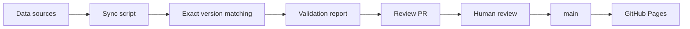

# AI Model Leaderboard

> **What should a system do when the data doesn't line up?**

This project is an AI model evaluation platform built around one rule: **if the version cannot be verified, don't pretend the score belongs there.**

The public board ranks same-version scores from Artificial Analysis. A separate editorial board can re-rank by user-adjustable preferences. Data sync runs automatically, but publication still waits for human review.

**Live:** https://joker01-01.github.io/ai-model-leaderboard/

`React 19` · `TypeScript` · `Vite 7` · `GitHub Actions` · `GitHub Pages`

## Why I built it

Model leaderboards often collapse several different things into one number: different model versions, blind user preference, benchmark scores, and editorial judgment.

That creates a simple reliability problem:

**when two names look similar, is “close enough” good enough?**

Here, the answer is no.

A missing or ambiguous match stays unresolved. I would rather leave a score blank than make one look more certain than it is.

## What it does

The project currently tracks 20 concrete model versions and exposes two different views:

- **Public evaluation board** — ranks by same-version Artificial Analysis Intelligence Index.
- **Editorial board** — re-ranks by configurable preferences such as intelligence, coding, tool use, reasoning/math, price, and open weights.

Arena data is shown as user-preference reference in model details. It does not determine the public ranking.

## The publish pipeline



Sources:

- **Artificial Analysis Data API** — benchmark source for the public board.
- **LMArena leaderboard dataset** — blind-preference reference in the detail view.

The sync workflow runs daily at 01:20 Beijing time. It updates generated snapshots and opens or updates a review PR. It does **not** publish directly. Merging into `main` triggers the Pages deployment workflow.

## Reliability rules

- **Exact version matching only.** Similar names, unknown versions, or multiple hits remain unmatched.
- **Ambiguity becomes data, not a guess.** Missing and ambiguous cases are written to `data/sync-report.json`.
- **Public rank and editorial preference stay separate.** Editorial weights never rewrite the public benchmark rank.
- **Arena is reference, not rank.** User preference does not get mixed into the headline public score.
- **Generated snapshots are generated.** `src/data/generated/aaSnapshot.ts` and `arenaSnapshot.ts` should not be edited by hand.
- **Human review stays in the loop.** Automated sync prepares a change; a person decides whether it is publishable.

## Project structure

| Area | Key files |
| --- | --- |
| Model metadata | `src/data/models.ts` |
| Public benchmark mapping | `src/data/benchmarks.ts` |
| Editorial scoring | `src/lib/editorial.ts` |
| AA generated snapshot | `src/data/generated/aaSnapshot.ts` |
| Arena generated snapshot | `src/data/generated/arenaSnapshot.ts` |
| Sync / matching report | `data/sync-report.json` |
| Sync workflow | `.github/workflows/sync-data.yml` |
| Deploy workflow | `.github/workflows/deploy.yml` |

## Run it locally

```bash
npm install
npm run dev
npm run build
```

Manual sync:

```powershell
$env:AA_API_KEY = "your Artificial Analysis API key"
npm run sync:data
npm run build
```

Without `AA_API_KEY`, the sync keeps the previous verified Artificial Analysis snapshot and can still process the Arena side.

## What is not automated yet

There is currently no unit-test script in `package.json` for scoring or matching. Reliability is enforced by matching policy, the generated sync report, the review PR, and the separation between sync and deploy.

That is also the clearest engineering gap in the current version. The next useful addition would be focused tests for:

- exact version → match
- similar name → reject
- unknown version → reject
- multiple candidates → ambiguous
- missing public score → pending
- editorial score never changes public rank

## Limitations

- The catalog is a curated set of 20 pinned versions, not the entire model market.
- Scores are snapshots from selected public benchmark sources, not vendor-official conclusions.
- Model versions, prices, context windows, and licenses change quickly.
- Artificial Analysis sync requires `AA_API_KEY` for fresh benchmark data.
- Automated scoring/matching tests are still missing.

## Data principle

Before recording a public score:

1. Confirm the exact model version.
2. Keep the benchmark name, observation date, and source URL.
3. Use the same-version Artificial Analysis Intelligence Index for the public rank.
4. If the version cannot be confirmed, leave it pending.
5. Never mix editorial scores, sibling versions, or unverified claims into the public board.

<details>
<summary><strong>中文说明</strong></summary>

<br>

> **数据对不上时，一个系统应该怎么办？**

这个项目围绕一个很简单的规则：**版本不能确认，就不要假装这个分数属于它。**

公开榜按同版本 Artificial Analysis Intelligence Index 排名；编辑推荐榜再根据用户偏好重排。数据每天自动同步，但不会自动发布，先生成审核 PR，人工确认后才进入 `main` 并部署到 GitHub Pages。

我更愿意留一个空白，也不愿意让一个分数看起来比它实际更确定。

核心可靠性规则：

- 只接受精确版本匹配。
- 相似名称、未知版本、多条候选都保持未匹配。
- 缺失和歧义写入 `data/sync-report.json`，不偷偷补值。
- Arena 只作用户偏好参考，不参与公开名次。
- 编辑权重和公开榜分开。
- 自动同步之后仍保留人工审核门。

当前最大的工程短板也明确保留：`package.json` 里还没有 scoring / matching 的自动测试。后续最值得补的是精确匹配、模糊拒绝、歧义处理和 public/editorial 隔离测试。

</details>
