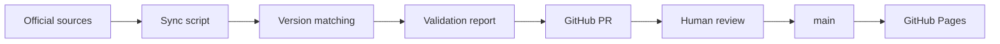

# AI Model Leaderboard

AI model evaluation platform with automated data sync and human-in-the-loop verification.

主榜只看**同版本**公开成绩；编辑推荐榜再按使用偏好选择。数据每天同步，**审核后才发布**。

**Live:** [https://joker01-01.github.io/ai-model-leaderboard/](https://joker01-01.github.io/ai-model-leaderboard/)

`中文 / English` · React 19 · TypeScript · Vite 7 · GitHub Actions · GitHub Pages

## Why this exists

Public model “leaderboards” mix versions, user polls, and editorial taste. This project separates:

1. **What the official score says for this exact version**
2. **What you might pick given your weights**

Unmatched versions are not filled in with a sibling model, a series name, or a handmade score.

## What it does

The catalog tracks 20 specific model versions and two entry points:

- **Public eval board** — rank by same-version Artificial Analysis Intelligence Index.
- **Editorial board** — re-rank with user-adjustable weights (intelligence, coding, tool use, reasoning/math, price, open-weights).

Models without a same-version Intelligence Index stay in a “pending public score” section. They are not ranked.

## Architecture



Sources:

- **Artificial Analysis** official Data API (Actions secret `AA_API_KEY`; never in the frontend)
- **Arena** official Hugging Face `lmarena-ai/leaderboard-dataset` `latest` snapshot — user-preference reference in the detail pane only, never the public ranking

## Engineering highlights

- **Exact version matching.** Scripts accept only exact AA slugs / Arena names. Similar names, unknown versions, or multiple hits are left unmatched and written to `data/sync-report.json`.
- **Human-in-the-loop publish.** `.github/workflows/sync-data.yml` runs daily (Beijing 01:20), builds the site, and opens/updates a review PR. It does **not** deploy. Merging `main` triggers Pages via `deploy.yml`.
- **No mixed headline score.** Coding / GPQA / tool-use / SWE-Pro / BrowseComp appear as detail metrics. They are not re-weighted into the public rank.
- **Arena is reference, not rank.** Blind-test preference stays in the model detail view.
- **Generated snapshots.** `src/data/generated/aaSnapshot.ts` and `arenaSnapshot.ts` are produced by `scripts/sync-data.mjs`; do not edit them by hand.

There is no unit-test script in `package.json`. Reliability is encoded in matching policy, the sync report, and the review PR — not in an automated test suite.

## Demo

Open the live site: [AI 模型排行榜](https://joker01-01.github.io/ai-model-leaderboard/)

`main` updates publish through GitHub Actions → GitHub Pages.

## Tech stack

| Area | Choice |
| --- | --- |
| UI | React 19, TypeScript 5.9, Vite 7, static CSS |
| Data | `src/data/models.ts`, `benchmarks.ts`, generated snapshots |
| Sync | Node `scripts/sync-data.mjs`, hyparquet for Arena parquet |
| CI/CD | `sync-data.yml` (review PR), `deploy.yml` (Pages) |

## Getting started

```bash
npm install
npm run dev
npm run build
```

Manual sync:

```bash
# PowerShell
$env:AA_API_KEY = "your Artificial Analysis API key" # optional; without it only Arena syncs
npm run sync:data
npm run build
```

## Data rules

Files:

- `src/data/models.ts` — model metadata, price, license, sources
- `src/lib/editorial.ts` — editorial score rules
- `src/data/benchmarks.ts` — public eval snapshot and version mapping
- `src/data/generated/aaSnapshot.ts` — AA official API snapshot
- `src/data/generated/arenaSnapshot.ts` — Arena reference snapshot
- `data/sync-report.json` — exact match / missing / ambiguous report

When maintaining public data:

1. Confirm the concrete model version before recording a score.
2. Keep benchmark name, observation date, and a reachable source URL.
3. Public rank uses same-version AA Intelligence Index only.
4. If the version cannot be confirmed, leave it in “pending”.
5. Do not mix editorial scores, other versions, or unverified media claims into the public board.

## Limitations

- Catalog size is 20 pinned versions, not the whole market.
- AA sync needs `AA_API_KEY` in Actions secrets; without it the previous verified AA snapshot is kept.
- No automated test suite for scoring or matching.
- Scores are public snapshots, not vendor-official conclusions. Recheck vendor pages before using a model.

## Disclaimer

The public board is a traceable public snapshot. The editorial board is a weighted helper, not a substitute for a benchmark. Versions, prices, context windows, and licenses change quickly.
