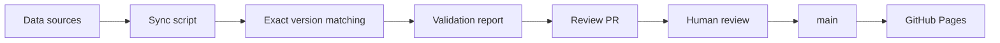

# AI Model Leaderboard

[](https://react.dev/)
[](https://www.typescriptlang.org/)
[](https://vite.dev/)
[](https://fastapi.tiangolo.com/)
[](https://joker01-01.github.io/ai-model-leaderboard/)
[](#reliability-rules)
[](#the-publish-pipeline)

> **What should a system do when the data doesn't line up?**

This project is an AI model evaluation platform built around one rule: **if the version cannot be verified, don't pretend the score belongs there.**

The public board ranks same-version scores from Artificial Analysis. A separate editorial board can re-rank by user-adjustable preferences. Data sync runs automatically, but publication still waits for human review.

**Live:** https://joker01-01.github.io/ai-model-leaderboard/

`React 19` · `TypeScript` · `Vite 7` · `GitHub Actions` · `GitHub Pages`

## Why I built it

Model leaderboards often collapse several different things into one number: different model versions, blind user preference, benchmark scores, and editorial judgment.

That creates a simple reliability problem:

**when two names look similar, is “close enough” good enough?**

Here, the answer is no.

A missing or ambiguous match stays unresolved. I would rather leave a score blank than make one look more certain than it is.

## What it does

The project currently tracks 20 concrete model versions and exposes two different views:

- **Public evaluation board** — ranks by same-version Artificial Analysis Intelligence Index.
- **Editorial board** — re-ranks by configurable preferences such as intelligence, coding, tool use, reasoning/math, price, and open weights.

Arena data is shown as user-preference reference in model details. It does not determine the public ranking.

The repository also contains the Phase C ModelOps Agent backend. It strictly loads the generated evidence JSON and runs five typed operations—catalog filtering, benchmark lookup, pricing, allowlisted provider-document search, and pure update proposals—inside a bounded LangGraph workflow. FastAPI exposes health, non-streaming invoke, and typed POST SSE endpoints; an OpenAI-compatible Responses gateway uses DeepSeek V4 Flash for intent extraction and validates its output locally, while ranking, evidence checks, and proposal decisions remain deterministic.

The Agent API is not connected to the website yet. The existing leaderboard remains independently usable; the React Agent panel and public backend deployment remain Phase D work.

## The publish pipeline



Sources:

- **Artificial Analysis Data API** — benchmark source for the public board.
- **LMArena leaderboard dataset** — blind-preference reference in the detail view.

The sync workflow runs daily at 01:20 Beijing time. It updates generated snapshots and opens or updates a review PR. It does **not** publish directly. Merging into `main` triggers the Pages deployment workflow.

## Reliability rules

- **Exact version matching only.** Similar names, unknown versions, or multiple hits remain unmatched.
- **Ambiguity becomes data, not a guess.** Missing and ambiguous cases are written to `data/sync-report.json`.
- **Public rank and editorial preference stay separate.** Editorial weights never rewrite the public benchmark rank.
- **Arena is reference, not rank.** User preference does not get mixed into the headline public score.
- **Generated snapshots are generated.** `src/data/generated/aaSnapshot.ts` and `arenaSnapshot.ts` should not be edited by hand.
- **Human review stays in the loop.** Automated sync prepares a change; a person decides whether it is publishable.

## Project structure

| Area | Key files |
| --- | --- |
| Model metadata | `src/data/models.ts` |
| Public benchmark mapping | `src/data/benchmarks.ts` |
| Editorial scoring | `src/lib/editorial.ts` |
| AA generated snapshot | `src/data/generated/aaSnapshot.ts` |
| Arena generated snapshot | `src/data/generated/arenaSnapshot.ts` |
| ModelOps reviewed/generated data | `data/modelops/` |
| ModelOps data contracts/tests | `scripts/modelops-data-schema.ts`, `scripts/modelops-data.test.ts` |
| Strict Python contracts/repository | `backend/app/domain/`, `backend/app/repositories/` |
| Five typed ModelOps tools | `backend/app/tools/` |
| LangGraph workflow/verifier | `backend/app/graph/`, `backend/app/services/` |
| FastAPI and typed SSE boundary | `backend/app/main.py`, `backend/app/api/` |
| Runtime configuration | `.env.example`, `backend/app/config.py` |
| Offline Agent evaluations | `backend/evals/` |
| Sync / matching report | `data/sync-report.json` |
| Sync workflow | `.github/workflows/sync-data.yml` |
| Deploy workflow | `.github/workflows/deploy.yml` |

## Run it locally

```bash
npm install
npm run dev
npm run build
npm run modelops:data:check
npm run test:modelops-data
```

Manual sync:

```powershell
$env:AA_API_KEY = "your Artificial Analysis API key"
npm run sync:data
npm run build
```

Without `AA_API_KEY`, the sync keeps the previous verified Artificial Analysis snapshot and can still process the Arena side.

Offline ModelOps Agent verification requires Python 3.12:

```powershell
cd backend
python -m pip install -e ".[dev]"
python -m pytest -q
python -m ruff check app tests evals
python -m mypy app tests evals
python evals/run.py
```

These checks use committed generated data, `FakeModelGateway`, and injected provider-document responses. They do not call a model provider or fetch live provider documentation.

To start the Phase C API locally, export the backend environment values and run Uvicorn from `backend/`. The repository does not auto-load `.env.example`:

```powershell
$env:MODELOPS_MODEL_API_KEY = "<DeepSeek API key>"
python -m uvicorn app.main:app --host 127.0.0.1 --port 8000
```

Available endpoints:

- `GET /healthz` — runtime readiness.
- `POST /api/v1/agent/query:invoke` — one structured response.
- `POST /api/v1/agent/query` — typed SSE with monotonic sequence, heartbeat comments, one terminal event, and disconnect cancellation.

The API is intentionally stateless: `session_id` is accepted as client context, but persistence and stream replay are not implemented.

## What is not automated yet

`npm run test:modelops-data` checks strict reviewed-data contracts, exact source/version bindings, and public/editorial ranking equivalence. The 91-test backend suite covers the strict repository, all five tools, graph routing and terminal states, concrete HTTP boundaries, health/invoke/SSE contracts, cancellation, and safe errors; 24 deterministic cases cover recommendation, clarification, stale/missing evidence, exact-version explanations, pure proposals, and unrecoverable failures. The CI workflow already runs these backend gates with Python lint and type checking in addition to the frontend checks.

The remaining acceptance gaps are general frontend interaction tests and a network-backed sync freshness gate. Publication still requires human review.

## Limitations

- The catalog is a curated set of 20 pinned versions, not the entire model market.
- Scores are snapshots from selected public benchmark sources, not vendor-official conclusions.
- Model versions, prices, context windows, and licenses change quickly.
- Artificial Analysis sync requires `AA_API_KEY` for fresh benchmark data.
- Structured prices currently cover only a small exact-version/provider subset; missing prices, end-user country availability, and latency stay unresolved instead of being inferred.
- The Agent has no frontend panel, persistence, stream replay, authentication, or public backend deployment yet.
- The concrete clients are contract-tested with injected HTTP transports. The provider-document client passed a manual live transport smoke across all 11 distinct exact-allowlisted URLs, and the configured DeepSeek V4 Flash gateway accepted the complete structured intent schema in a live request.
- General UI interaction tests are not implemented yet.

## Data principle

Before recording a public score:

1. Confirm the exact model version.
2. Keep the benchmark name, observation date, and source URL.
3. Use the same-version Artificial Analysis Intelligence Index for the public rank.
4. If the version cannot be confirmed, leave it pending.
5. Never mix editorial scores, sibling versions, or unverified claims into the public board.

<details>
<summary><strong>中文说明</strong></summary>

<br>

> **数据对不上时，一个系统应该怎么办？**

这个项目围绕一个很简单的规则：**版本不能确认，就不要假装这个分数属于它。**

公开榜按同版本 Artificial Analysis Intelligence Index 排名；编辑推荐榜再根据用户偏好重排。数据每天自动同步，但不会自动发布，先生成审核 PR，人工确认后才进入 `main` 并部署到 GitHub Pages。

我更愿意留一个空白，也不愿意让一个分数看起来比它实际更确定。

核心可靠性规则：

- 只接受精确版本匹配。
- 相似名称、未知版本、多条候选都保持未匹配。
- 缺失和歧义写入 `data/sync-report.json`，不偷偷补值。
- Arena 只作用户偏好参考，不参与公开名次。
- 编辑权重和公开榜分开。
- 自动同步之后仍保留人工审核门。

当前已完成 Phase C：严格 Pydantic 契约、只读 JSON repository、五个 typed 工具、确定性 verifier、LangGraph 状态图、FastAPI health/invoke/SSE、使用 DeepSeek V4 Flash 的 OpenAI-compatible Responses 结构化输出 gateway、受限 HTTP 文档客户端，以及 24 条无网络 eval。SSE 保证递增 sequence、单一终止事件和断连取消；更新工具只生成 `awaiting_human_review` 提案，不写文件、不操作 Git，也不发布。

尚未实现 React Agent Panel、持久化/断点续传和公开后端部署；现有排行榜仍独立运行，发布仍须人工合并审核 PR。Phase C 的客户端契约均有注入 transport 离线验证；供应商文档客户端已完成 11 个精确 allowlist URL 的人工 live transport smoke，DeepSeek V4 Flash 也已通过完整意图 Schema 的真实 API 联调。

</details>
