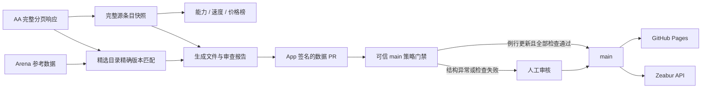

# AI 模型排行榜

[](https://react.dev/)
[](https://www.typescriptlang.org/)
[](https://vite.dev/)
[](https://fastapi.tiangolo.com/)
[](https://joker01-01.github.io/ai-model-leaderboard/)
[](#数据更新与发布)

一个基于 Artificial Analysis 完整源数据的 AI 模型能力、速度与价格排行榜。

当前前端以 `AI 模型排行榜` 为入口，提供：

- `模型能力榜单`：综合智能、编程智能、智能体能力；
- `模型速度榜单`：首字延迟与输出速度；
- `模型价格榜单`：输入价格与输出价格；
- `按需求选模型`：一次性需求推荐，使用完整 AA 榜单进行确定性筛选，并可通过服务端 DeepSeek 联网核验官方资料。

榜单保留 Artificial Analysis 的每个 `sourceId` 和独立配置，不按模型家族合并，也不把完整公开榜映射到内部精选目录。当前提交中的 AA 快照包含 643 个唯一源条目；不同榜单只展示具备该项有限数值的全部条目。

**线上地址：** https://joker01-01.github.io/ai-model-leaderboard/

> 本地提交与线上版本是两个状态。未完成 push、PR 和 Pages 部署前，线上页面可能仍是旧版。

## 设计原则

- **源条目保持原样。** 公开榜以 AA `sourceId` 为身份，同一模型的推理模式、努力等级等配置分别成行。
- **缺失值不猜。** 缺失指标不会用相似模型、同系列版本或推断值补齐。
- **公开排行与精选证据分离。** 完整 AA 榜单不扩张 `src/data/models.ts` 中的精选目录。
- **精选证据只做精确版本匹配。** 相似名称、未知版本和多候选继续保持未匹配或歧义。
- **编辑分数不改变公开名次。** Arena 仅作为内部精选目录的参考证据。
- **更新 PR 是发布边界。** 自动化只提交生成文件；结构异常和门禁失败必须人工审核。

详细产品约束见 [`DESIGN.md`](DESIGN.md)，阶段与验收见 [`FRONTEND_REFACTOR_PLAN.md`](FRONTEND_REFACTOR_PLAN.md)，当前状态见 [`PROJECT_STATE.md`](PROJECT_STATE.md)。

## 当前前端

- React 19、TypeScript、Vite 7，使用无依赖 hash router。
- 首页采用一个共边网格：能力榜横跨首行，速度榜与价格榜共边双栏，推荐入口横跨末行；窄屏按相同阅读顺序叠放。
- 首页每个榜单预览真实的前 5 行，不显示排名数字。
- 完整榜单不设 Top 20、分页或搜索框；提供固定开发者筛选。
- 模型名称是展示层简写，原始名称与源 ID 保留在快照中。`Claude` 前缀会省略，冲突时推理模式简写为 `R` / `NR`。
- 完整能力榜与窄屏首页能力预览使用固定 0–100 轴；桌面首页能力预览使用响应式上限与价格预览对齐。首页速度榜按首字延迟从快到慢排列，并用“越快越长”的反向蓝条；速度与价格图表都保留高于显示数据的易读上限，因此第一名不会被强行归一化为满条。
- 首次进入榜单和切换能力指标会播放一次数值/条形动画；筛选不会重复播放，并遵循 reduced-motion。

当前提交快照的有效行数：

| 榜单 | 行数 |
| --- | ---: |
| 综合智能 | 630 |
| 编程智能 | 255 |
| 智能体能力 | 197 |
| 模型速度 | 332 |
| 模型价格 | 440 |

## 数据更新与发布



每日北京时间 01:20 的同步工作流会读取 AA 的全部分页，生成完整公开快照，并继续维护旧版兼容快照、精选目录的 AA/Arena 精确匹配和 ModelOps JSON。工作流只创建或更新 PR，不直接写入 `main`。

完整公开快照由三份语义一致、可审查的生成文件组成：

- `src/data/generated/aaPublicSnapshot.ts`
- `data/aa/generated/snapshot.json`
- `data/aa/generated/sync-report.json`

首次完整快照必须人工审核。基线建立后，同结构的普通模型增删、指标值、日期和顺序变化可以在所有检查通过后自动合并；schema、wire fingerprint、指数版本、已有身份元数据异常、生成文件漂移、分页不完整或任一总量/指标覆盖下降超过 20% 会保留 PR 等待人工审核。

运维细节见 [`docs/data-refresh-automation.md`](docs/data-refresh-automation.md)。

## 项目结构

| 区域 | 关键文件 |
| --- | --- |
| 公共入口与路由 | `src/App.tsx`, `src/lib/hashRoute.ts` |
| 首页与完整榜单 | `src/pages/`, `src/components/SingleMetricChart.tsx`, `src/components/DualMetricChart.tsx` |
| 展示名称与开发者色彩 | `src/lib/modelPresentation.ts`, `src/components/CreatorIcon.tsx` |
| 完整 AA 前端契约与排序 | `src/lib/aaPublicSnapshot.ts`, `src/lib/aaRankings.ts` |
| 完整 AA 生成数据 | `src/data/generated/aaPublicSnapshot.ts`, `data/aa/generated/` |
| 完整 AA 同步与验证 | `scripts/aa-public-snapshot.mjs`, `scripts/sync-data.mjs` |
| 自动合并策略 | `scripts/data-update-policy.mjs`, `.github/workflows/auto-merge-data.yml` |
| 精选模型与证据 | `src/data/models.ts`, `src/data/benchmarks.ts`, `data/modelops/` |
| 旧版精选界面 | `src/components/Board.tsx`, `src/components/AaBoard.tsx` |
| FastAPI / LangGraph 后端 | `backend/app/` |
| 旧版 Agent SSE 客户端 | `src/features/agent/` |
| 部署 | `.github/workflows/deploy.yml`, `Dockerfile`, `docs/backend-deployment-zeabur.md` |

## 本地运行

```powershell
npm ci
npm run dev
```

提交前的主要检查：

```powershell
npm run test:frontend
npm run build
npm run test:data-update-policy
npm run test:modelops-data
npm run modelops:data:check
git diff --check
```

手动同步完整 AA 数据需要本地环境变量；不要把密钥写入仓库：

```powershell
$env:AA_API_KEY = "<Artificial Analysis API key>"
npm run sync:data
```

只更新三份完整公开快照时使用：

```powershell
node scripts/sync-data.mjs --aa-public-only
```

默认同步缺少 `AA_API_KEY` 时会保留已有 AA 快照并继续其兼容流程；`--aa-public-only` 缺少密钥会在写文件前失败。

## ModelOps 后端

仓库保留已部署的 FastAPI/LangGraph ModelOps 后端。它读取精选目录的严格生成 JSON，提供健康检查、一次性 invoke 和断连感知的 POST SSE，并通过注入的 DeepSeek Responses gateway 完成结构化意图提取。排序、证据检查和更新提案仍由确定性代码完成；`prepare_data_update` 只生成待审核提案，不写文件或发布。

本地启动前需导出后端密钥；`.env.example` 不会被自动加载：

```powershell
cd backend
python -m pip install -e ".[dev]"
$env:MODELOPS_MODEL_API_KEY = "<DeepSeek API key>"
python -m uvicorn app.main:app --host 127.0.0.1 --port 8000
```

后端地址：[`https://modelops-agent-api.zeabur.app`](https://modelops-agent-api.zeabur.app)。部署与恢复步骤见 [`docs/backend-deployment-zeabur.md`](docs/backend-deployment-zeabur.md)。

## 当前边界与下一阶段

- `#/advisor` 的一次性需求推荐、官方来源联网核验、限流与并发门禁已在本地 Phase 4 实现并验证，合并部署后才会成为线上行为。
- 首页社交页脚、Bilibili/GitHub/微信公众号入口、本地二维码、正式品牌图标和最终界面修正已在 Phase 5 完成视觉验收，并通过本地 Phase 6 门禁。
- 内部精选目录仍只有受控的精确版本集合；完整公开榜成员不会自动成为 ModelOps Agent 证据。
- 指标是带观测日期的第三方快照，不是厂商官方结论；价格、速度和模型配置会变化。
- Phase 1–4 已推送并进入 pull request #15；Phase 5 将通过独立的堆叠 pull request 审查。两者都尚未合并，也未执行新版本的 Pages 或 Zeabur 发布验收；以 [`PROJECT_STATE.md`](PROJECT_STATE.md) 为准。
