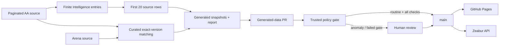

# AI Model Leaderboard

[](https://react.dev/)
[](https://www.typescriptlang.org/)
[](https://vite.dev/)
[](https://fastapi.tiangolo.com/)
[](https://joker01-01.github.io/ai-model-leaderboard/)
[](#reliability-rules)
[](#the-publish-pipeline)

> **What should a system do when the data doesn't line up?**

This project is an AI model evaluation platform built around one rule: **if the version cannot be verified, don't pretend the score belongs there.**

The public board follows the first 20 scored entries in the current Artificial Analysis Intelligence Index. Each source configuration remains its own row. A separate editorial board re-ranks a curated exact-version catalog by user-adjustable preferences. Routine generated-data refreshes publish automatically only after the trusted gate passes; anomalies remain open for human review.

**Frontend:** https://joker01-01.github.io/ai-model-leaderboard/

`React 19` · `TypeScript` · `Vite 7` · `GitHub Actions` · `GitHub Pages`

## Why I built it

Model leaderboards often collapse several different things into one number: different model versions, blind user preference, benchmark scores, and editorial judgment.

That creates a simple reliability problem:

**when two names look similar, is “close enough” good enough?**

Here, the answer is no.

A missing or ambiguous match stays unresolved. I would rather leave a score blank than make one look more certain than it is.

## What it does

The project exposes two deliberately separate views:

- **Public evaluation board** — displays the first 20 scored Artificial Analysis source entries in current Intelligence Index order. Reasoning, effort, and other configurations are not merged by model family.
- **Editorial board** — re-ranks a curated catalog of 20 concrete model versions by configurable preferences such as intelligence, coding, tool use, reasoning/math, price, and open weights.

Arena data is shown as user-preference reference in curated editorial model details. It does not appear in source-native public rows or determine the public ranking.

The repository also contains the Phase C ModelOps Agent backend. It strictly loads the generated evidence JSON and runs five typed operations—catalog filtering, benchmark lookup, pricing, allowlisted provider-document search, and pure update proposals—inside a bounded LangGraph workflow. FastAPI exposes health, non-streaming invoke, and typed POST SSE endpoints; an OpenAI-compatible Responses gateway uses DeepSeek V4 Flash for intent extraction and validates its output locally, while ranking, evidence checks, and proposal decisions remain deterministic.

Phase D adds a React evidence console backed by a typed, runtime-validated POST SSE client. It renders the real event sequence, exact-version resolution, recommendation evidence, pricing, gaps, exclusions, clarification, and review-only proposals; stopping or rejecting a malformed stream actively disconnects the request. The panel remains disabled when `VITE_AGENT_API_URL` is absent, so the leaderboard stays independently usable. The Pages workflow supplies the accepted Zeabur HTTPS origin after its focused Agent tests pass.

## The publish pipeline



Sources:

- **Artificial Analysis Data API** — benchmark source for the public board.
- **LMArena leaderboard dataset** — blind-preference reference in the detail view.

The sync workflow runs daily at 01:20 Beijing time. It reads the complete paginated AA response, derives the source-native public leaderboard, and separately maintains exact-version evidence for the curated catalog. It updates generated snapshots and opens or updates a pull request; it never pushes directly to `main`. The trusted gate automatically merges only routine score/date/order refreshes with stable public membership, index version, curated exact identities, approved generated paths, verified provenance, and all required checks. Membership, version, identity, or evidence anomalies stay open for human review. A merge into `main` triggers GitHub Pages and the linked Zeabur deployment.

## Reliability rules

- **Source rows stay source rows.** Public entries use AA `sourceId` identity; separate configurations are neither deduplicated nor projected into the curated catalog.
- **Exact version matching for curated evidence only.** Similar names, unknown versions, or multiple hits remain unmatched in the editorial/Agent catalog.
- **Ambiguity becomes data, not a guess.** Missing and ambiguous cases are written to `data/sync-report.json`.
- **Public rank and editorial preference stay separate.** Editorial weights never rewrite the public benchmark rank.
- **Arena is reference, not rank.** User preference does not get mixed into the headline public score.
- **Generated snapshots are generated.** `src/data/generated/aaSnapshot.ts` and `arenaSnapshot.ts` should not be edited by hand.
- **The pull request stays the publication boundary.** Routine refreshes may auto-merge only after every gate passes; anomalies require human review.

## Project structure

| Area | Key files |
| --- | --- |
| Model metadata | `src/data/models.ts` |
| Public AA leaderboard | `src/lib/aaLeaderboard.ts`, `src/components/AaBoard.tsx` |
| Curated benchmark mapping | `src/data/benchmarks.ts` |
| Editorial scoring | `src/lib/editorial.ts` |
| AA generated snapshot | `src/data/generated/aaSnapshot.ts` |
| Arena generated snapshot | `src/data/generated/arenaSnapshot.ts` |
| ModelOps reviewed/generated data | `data/modelops/` |
| ModelOps data contracts/tests | `scripts/modelops-data-schema.ts`, `scripts/modelops-data.test.ts` |
| Curated rows / sorting / rank | `src/components/Board.tsx`, `src/lib/entries.ts`, `src/lib/ranking.ts` |
| Strict Python contracts/repository | `backend/app/domain/`, `backend/app/repositories/` |
| Five typed ModelOps tools | `backend/app/tools/` |
| LangGraph workflow/verifier | `backend/app/graph/`, `backend/app/services/` |
| FastAPI and typed SSE boundary | `backend/app/main.py`, `backend/app/api/` |
| Typed SSE client and Agent Panel | `src/features/agent/` |
| Runtime configuration | `.env.example`, `backend/app/config.py` |
| Zeabur backend deployment | `Dockerfile`, `.dockerignore`, `docs/backend-deployment-zeabur.md` |
| Offline Agent evaluations | `backend/evals/` |
| AA leaderboard generator | `scripts/aa-leaderboard.mjs` |
| Sync / matching report | `scripts/sync-data.mjs`, `data/sync-report.json` |
| Sync workflow | `.github/workflows/sync-data.yml` |
| Routine-refresh policy / merge workflow | `scripts/data-update-policy.mjs`, `.github/workflows/auto-merge-data.yml` |
| Deploy workflow | `.github/workflows/deploy.yml` |

## Run it locally

```bash
npm install
npm run dev
npm run build
npm run modelops:data:check
npm run test:data-update-policy
npm run test:modelops-data
npm run test:agent
npm run test:frontend
```

Manual sync:

```powershell
$env:AA_API_KEY = "your Artificial Analysis API key"
npm run sync:data
npm run build
```

Without `AA_API_KEY`, the sync keeps the previous verified Artificial Analysis snapshot and can still process the Arena side.

Offline ModelOps Agent verification requires Python 3.12:

```powershell
cd backend
python -m pip install -e ".[dev]"
python -m pytest -q
python -m ruff check app tests evals
python -m mypy app tests evals
python evals/run.py
```

These checks use committed generated data, `FakeModelGateway`, and injected provider-document responses. They do not call a model provider or fetch live provider documentation.

To start the Phase C API locally, export the backend environment values and run Uvicorn from `backend/`. The repository does not auto-load `.env.example`:

```powershell
$env:MODELOPS_MODEL_API_KEY = "<DeepSeek API key>"
python -m uvicorn app.main:app --host 127.0.0.1 --port 8000
```

Available endpoints:

- `GET /` — browser-friendly service status and links to the public product, API docs, and readiness endpoint.
- `GET /healthz` — runtime readiness.
- `POST /api/v1/agent/query:invoke` — one structured response.
- `POST /api/v1/agent/query` — typed SSE with monotonic sequence, heartbeat comments, one terminal event, and disconnect cancellation.

The API is intentionally stateless: `session_id` is accepted as client context, but persistence and stream replay are not implemented.

## Deploy the backend

The backend runs as `modelops-agent-api` on a Zeabur-managed Tencent Cloud server in Singapore, with public origin `https://modelops-agent-api.zeabur.app`. Follow [`docs/backend-deployment-zeabur.md`](docs/backend-deployment-zeabur.md) for the verified configuration and recreation/rollback procedure. Keep the Docker build context at the repository root so the image contains both `backend/app/` and the committed ModelOps JSON under `data/modelops/generated/`.

## Verification and remaining work

`npm run test:modelops-data` checks the curated ModelOps adapter contracts, exact source/version bindings, and curated objective/editorial evidence equivalence. The public AA board has separate generator, parser, component, and refresh-policy tests. The 92-test backend suite covers the strict repository, all five tools, graph routing and terminal states, concrete HTTP boundaries, the browser landing page, health/invoke/SSE contracts, cancellation, and safe errors; 24 deterministic cases cover recommendation, clarification, stale/missing evidence, exact-version explanations, pure proposals, and unrecoverable failures. The CI workflow already runs these backend gates with Python lint and type checking in addition to the frontend checks.

Phase D is published through GitHub Pages. The live browser DOM contains the configured Agent Panel and the public/editorial leaderboard views, and the recommendation, exact-version explanation, and review-only proposal paths passed HTTPS transport checks carrying the production Pages `Origin` header. A reviewed Git-revert deployment/recovery drill also completed against Zeabur. The reverted Phase D commit did not change backend build inputs, so the drill verifies GitHub-to-Zeabur revision switching, health continuity, and recovery rather than rollback between different backend implementations. A fail-on-drift mode for the standalone local `sync:data:check` command and broader frontend interaction coverage remain separate future work.

The conditional data-refresh control plane is operational: a repository-scoped GitHub App prepares the pull request, protected `main` requires the complete `verify` check, and trusted-main policy code performs the guarded merge. Live acceptance covered both an anomaly refresh retained for human review ([PR #7](https://github.com/joker01-01/ai-model-leaderboard/pull/7)) and a routine refresh merged automatically ([PR #9](https://github.com/joker01-01/ai-model-leaderboard/pull/9)). See [`docs/data-refresh-automation.md`](docs/data-refresh-automation.md).

## Limitations

- The public board is intentionally limited to the first 20 scored entries returned by the current AA Intelligence source snapshot; it is not the entire model market.
- The separate editorial/Agent catalog is a curated set of 20 pinned versions. Public membership does not automatically become Agent evidence.
- Scores are snapshots from selected public benchmark sources, not vendor-official conclusions.
- Model versions, prices, context windows, and licenses change quickly.
- Artificial Analysis sync requires `AA_API_KEY` for fresh benchmark data.
- Structured prices currently cover only a small exact-version/provider subset; missing prices, end-user country availability, and latency stay unresolved instead of being inferred.
- The Agent Panel is stateless and has no persistence, stream replay, authentication, or rate limiting. The Zeabur runtime has passed health/invoke/SSE/CORS checks, a bounded client-disconnect and endpoint-stability observation, and a recorded Git-revert deployment/recovery drill. Because the reverted Phase D commit did not change backend build inputs, the drill covers deployment switching and recovery rather than a behaviorally different backend image. The post-recovery service graph showed low-single-digit CPU percentages and roughly 65-75 MB memory, but this is a point-in-time operational snapshot rather than a sustained-load test.
- The concrete clients are contract-tested with injected HTTP transports. The provider-document client passed a manual live transport smoke across all 11 distinct exact-allowlisted URLs, and the configured DeepSeek V4 Flash gateway accepted the complete structured intent schema in a live request.
- Focused Agent parser and panel interaction tests exist; broad end-to-end coverage for the rest of the leaderboard does not.

## Data principle

Before recording a public score:

1. Preserve each public entry's AA source ID, concrete configuration name, source slug, observation date, and index version.
2. Rank only finite values from the current Artificial Analysis Intelligence Index.
3. Keep distinct source configurations as distinct rows instead of deduplicating by model family.
4. Apply exact-version matching separately when attaching evidence to the curated editorial/Agent catalog.
5. Never mix editorial scores, sibling-version evidence, or inferred metadata into the public board.

<details>
<summary><strong>中文说明</strong></summary>

<br>

> **数据对不上时，一个系统应该怎么办？**

这个项目围绕一个很简单的规则：**版本不能确认，就不要假装这个分数属于它。**

公开榜直接展示 Artificial Analysis 当前 Intelligence Index 的前 20 个有分数源条目；同一模型的不同推理、努力等配置分别成行，不按模型家族合并。编辑推荐榜和 ModelOps Agent 继续使用独立的 20 个精确版本精选目录。数据每天自动同步并生成更新 PR；公开榜成员、指数版本、精选目录身份、文件范围、提交来源和全部检查均稳定的例行更新会自动合并，异常更新保留给人工审核。

我更愿意留一个空白，也不愿意让一个分数看起来比它实际更确定。

核心可靠性规则：

- 公开榜按 AA `sourceId` 保留每个源配置，不去重、不套用精选目录资料。
- 精选目录证据只接受精确版本匹配。
- 相似名称、未知版本、多条候选都保持未匹配。
- 缺失和歧义写入 `data/sync-report.json`，不偷偷补值。
- Arena 只作用户偏好参考，不参与公开名次。
- 编辑权重和公开榜分开。
- 更新 PR 是发布边界：例行更新通过门禁后自动合并，异常更新仍需人工审核。

当前已完成 Phase C 后端和 Phase D 前端实现：严格 Pydantic 契约、只读 JSON repository、五个 typed 工具、确定性 verifier、LangGraph 状态图、FastAPI health/invoke/SSE、DeepSeek V4 Flash gateway、受限 HTTP 文档客户端，以及带深层运行时契约校验的 React Agent Panel。SSE 保证递增 sequence、单一终止事件和断连取消；更新工具只生成 `awaiting_human_review` 提案，不写文件、不操作 Git，也不发布。

尚未实现持久化/断点续传、认证与限流；Zeabur 新加坡后端已通过 health、DeepSeek-backed invoke、POST SSE、GitHub Pages CORS、客户端主动断连、约 10 分钟端点稳定性检查，以及一次 Git-revert 部署切换/恢复演练。公开浏览器 DOM 已确认 Agent Panel 与原排行榜同时存在，三个 Agent 路径通过携带生产 Pages `Origin` 请求头的 HTTPS 传输检查。被回滚的 Phase D 提交没有改变后端构建输入，因此该演练验证的是 GitHub 到 Zeabur 的版本切换、健康连续性和恢复流程，而不是两个不同后端实现之间的回退。恢复后的服务图表显示 CPU 为低个位数百分比、内存约 65-75 MB，但这只是运维快照，不是持续负载测试。现有排行榜在 API 未配置时仍可独立运行；例行数据更新通过严格门禁后自动合并，异常更新仍须人工审核。

</details>
