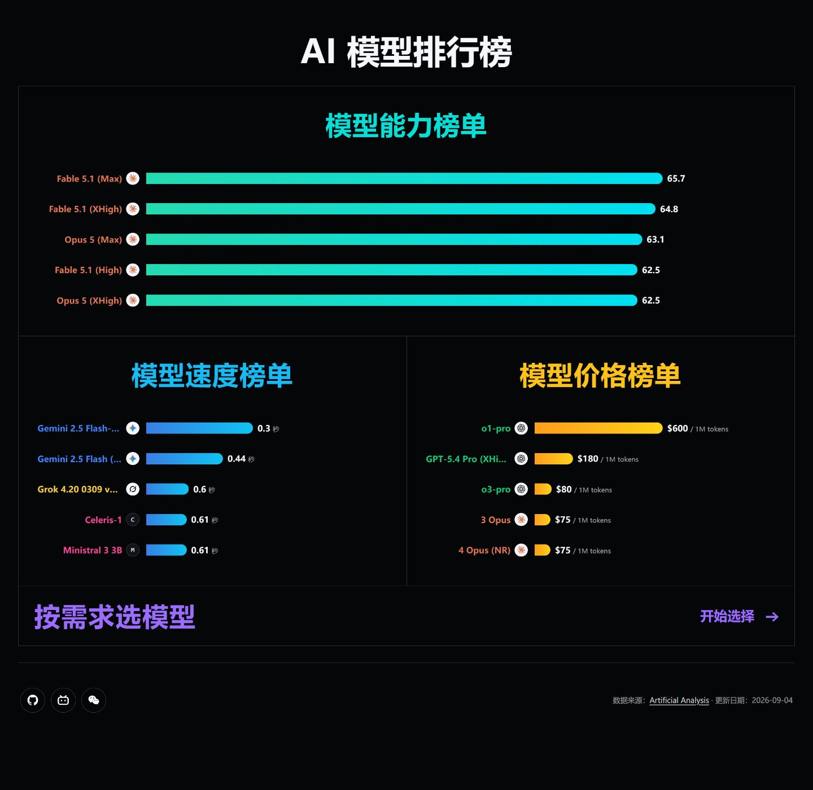
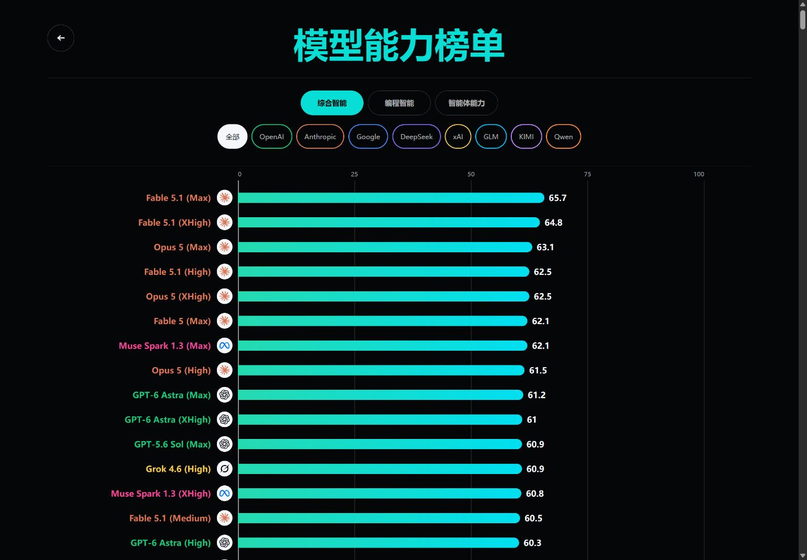
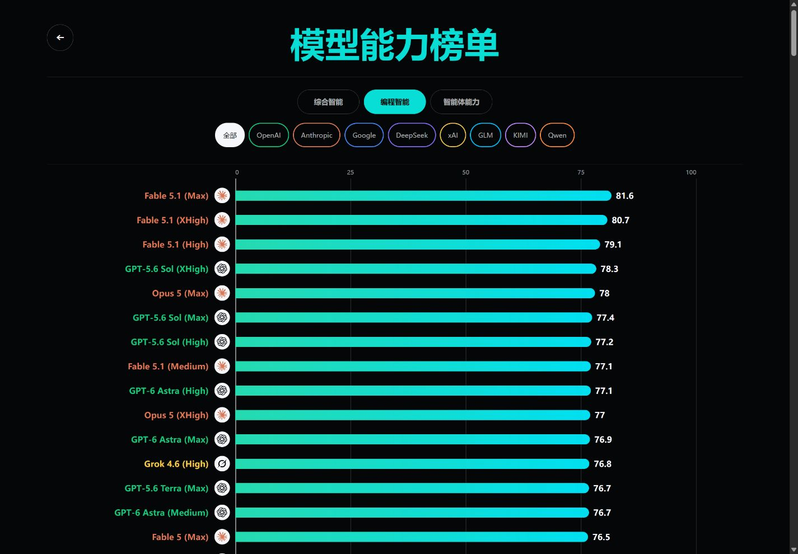
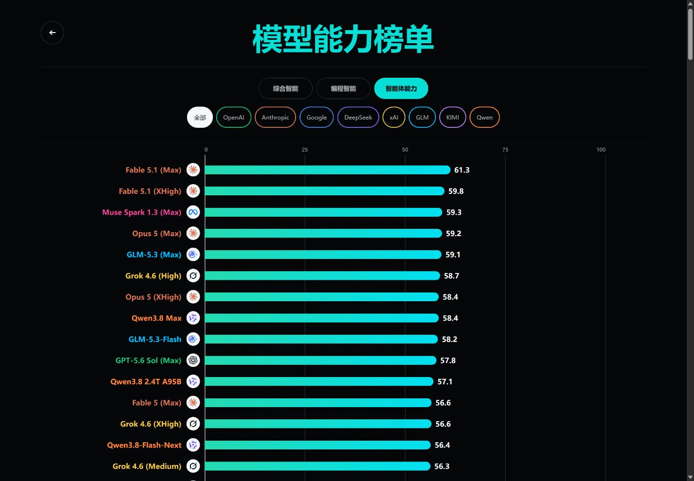
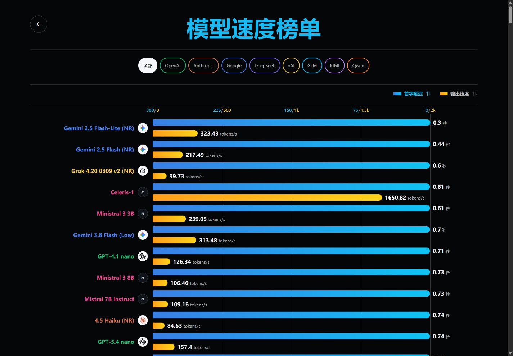
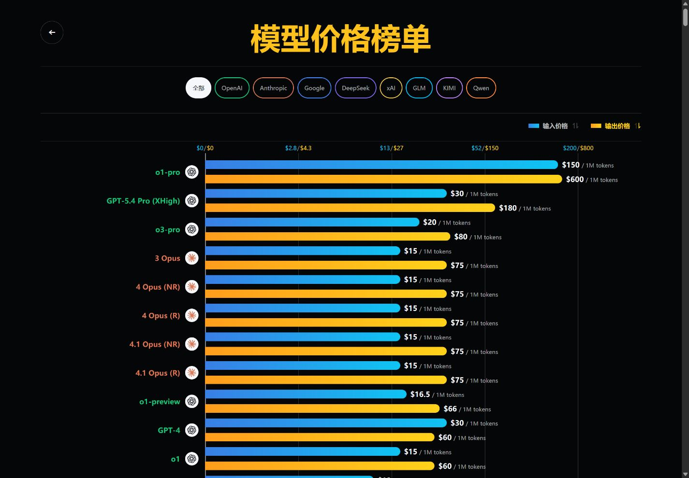
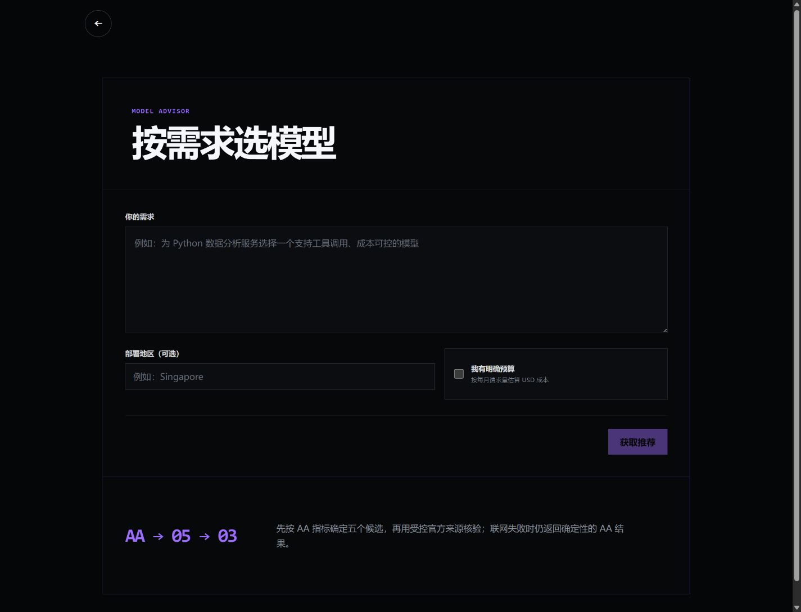

# AI 模型排行榜

基于 Artificial Analysis 数据，对比 AI 模型的能力、速度与价格，也可以按需求选择模型。

**[在线体验 →](https://joker01-01.github.io/ai-model-leaderboard/)**

- **模型能力**：综合智能、编程智能、智能体能力。
- **模型速度**：首字延迟与输出速度。
- **模型价格**：输入价格与输出价格。
- **按需求选模型**：根据需求和预算筛选，结合官方资料核验给出推荐。

支持桌面和手机浏览。数据来源于 [Artificial Analysis](https://artificialanalysis.ai/)，更新日期见网站页脚。

## 页面预览

### 首页

查看全部榜单和选模型页面

### 综合智能

### 编程智能

### 智能体能力

### 模型速度

### 模型价格

### 按需求选模型

