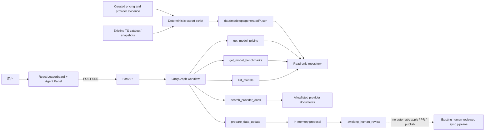
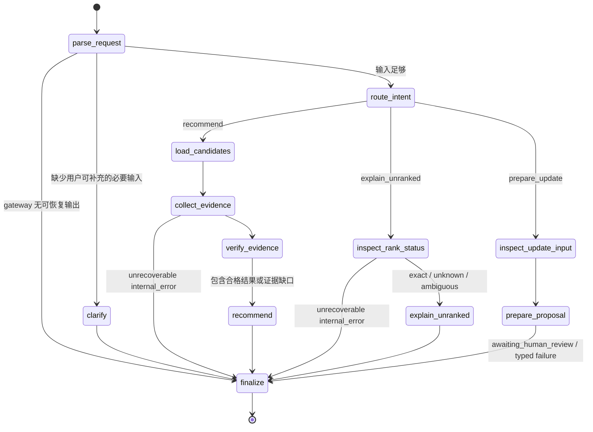

# ModelOps Agent 架构与实施方案

状态：已确认，按阶段实施中

方案来源：用户提供的外部 `modelops-agent-handoff.md`，其实施方案已迁入本文件，并结合 2026-09-02 仓库状态复核。

实施边界：本文件只定义方案、改动范围和验收标准，不代表相关能力已经完成

## 1. 目标与非目标

在保留现有 AI Model Leaderboard 的前提下，增加一个面向三个固定场景的 ModelOps Agent：

1. 在预算、地区、延迟、许可证等约束下推荐适合 Python 编程的具体模型版本。
2. 解释某个模型为何未上榜，并明确区分数据缺失、版本未知和多候选歧义。
3. 检查基准输入并生成可审核的数据更新提案，但不自动修改榜单、创建发布或绕过人工审核。

MVP 不包含：

- 多 Agent 协作；
- 向量数据库或完整 RAG 平台；
- 自动合并 PR、自动发布或任何写入生产数据的工具；
- 高并发、生产 SLA、质量提升等未经测试的承诺；
- MCP 暴露、持久化 checkpoint、完整可观测平台和 50–100 条评估集。这些保留为后续里程碑。

## 2. 仓库基线审查（Phase A 实施前）

### 2.1 实施前架构

```text
GitHub Actions 定时任务
  -> scripts/sync-data.mjs
  -> 精确 alias 匹配 AA / Arena
  -> src/data/generated/*.ts + data/sync-report.json
  -> 自动创建数据审核 PR
  -> 人工合并 main
  -> Vite 构建 React 静态站
  -> GitHub Pages
```

方案确认时，项目是单包 React 19 + TypeScript + Vite 7 静态站：

- `src/data/models.ts` 保存 20 个具体模型版本的资料和来源。
- `src/data/benchmarks.ts` 合并静态评测快照与 AA 自动同步结果。
- `src/lib/score.ts` 负责公开榜与编辑榜的评分规则。
- `src/lib/editorial.ts` 从公开指标、价格档位和开放状态生成编辑榜基础分。
- `src/App.tsx` 同时承担数据装配、筛选、排序和全部主要页面组件。
- `scripts/sync-data.mjs` 获取 AA / Arena 数据，只接受精确 slug/name alias，生成快照和同步报告。
- `.github/workflows/sync-data.yml` 只创建/更新审核 PR；`.github/workflows/deploy.yml` 只在 `main` 上部署 Pages。

### 2.2 已核对的事实

- `npm run build` 当时通过，包含 TypeScript 检查和 Vite 生产构建。
- `package.json` 当时没有 test、lint 或后端命令。
- 仓库当时没有 FastAPI、LangGraph、SSE、Agent 工具、评估集、`AGENTS.md` 或 `PROJECT_STATE.md`。
- README 描述的人工发布边界与工作流一致：同步任务只准备 PR，合并 `main` 后才部署。
- 精确版本匹配确实存在，但 alias 清单当时内嵌在 `scripts/sync-data.mjs`，尚不能被 Python 后端直接复用。
- 当时 `priceTier` / `priceNote` 只能作展示，不能可靠判断“月预算是否足够”；仓库也没有结构化地区可用性或延迟数据。
- `sync:data:check` 使用 dry-run 避免写文件，但当前并不因检测到差异而返回非零退出码，因此不能单独作为 CI 漂移门禁。
- GitHub Pages 只能托管静态前端；FastAPI 必须作为独立进程运行并通过配置的 API 地址接入。

## 3. 推荐架构

采用“现有前端不拆包 + 独立 Python 后端 + 只读数据快照适配层”的窄改造。



关键取舍：

- 不迁移或重写现有排行榜数据层。新增确定性导出脚本，把现有 TypeScript 目录与快照编译为 Python 可读取的 JSON；生成物提交到仓库并由 CI 检查，避免运行后端时依赖 Node。
- 结构化价格按受控 `(provider_id, provider_model_id)` 二元组、稳定 region/offer ID、单请求 token 区间、币种、计价方式、观察日期、确定性复核期限和来源 URL 保存。Phase A 强制 `stale_after = observed_at + 30` 个日历日；若来源另有 `valid_through`，生效截止日取两者较早值并包含当天。缺字段或查询日期晚于截止日时返回 `missing_evidence` / `stale_evidence`，不从价格档位推算。
- `provider-sources.json` 只是 exact-version 官方文档 allowlist；catalog 的 `license` 仍是展示元数据，只有工具实际命中的官方文档摘录才能作为许可证约束证据。
- 价格记录只提供 provider deployment region 的正向证据，不能据此声称某国最终用户一定可访问。某地区没有记录表示证据缺失，不能推断为不支持；MVP 尚不保存结构化负面或最终用户国家可用性证据。
- Provider Docs MVP 使用 allowlist + HTTPS 拉取/文本提取，不引入向量库。只返回实际命中的来源和摘录；失败时保留已有工作流状态并降级为“证据不足”。
- 所有工具均为只读或纯提案工具。MVP 不提供 apply、commit、open PR、merge 或 publish API。
- 前端继续部署到 GitHub Pages，通过 `VITE_AGENT_API_URL` 指向独立 FastAPI 服务；未配置时排行榜仍可独立使用，Agent 区显示未连接状态。

## 4. LangGraph 状态机

### 4.1 核心状态

`AgentState` 使用 `TypedDict` 定义图内状态，边界输入输出使用 Pydantic：

| 字段 | 类型 | 作用 |
| --- | --- | --- |
| `run_id`, `trace_id` | `str` | 单次运行和链路定位 |
| `request` | `AgentRequest` | 用户原始请求和可选 session 信息 |
| `parsed` | `ParsedAgentRequest` | gateway 输出的严格结构化 intent/constraints/update payload |
| `intent` | enum | `recommend` / `explain_unranked` / `prepare_update` |
| `constraints` | `SelectionConstraints` | 任务、月预算、币种、地区、延迟、许可证、开放权重要求 |
| `missing_constraints` | `list[str]` | 必须向用户澄清的字段 |
| `candidate_model_ids` | `list[str]` | 只保存 catalog 中的精确 ID |
| `filter_decisions` | `list[CandidateDecision]` | 保留每个候选的 included 状态和稳定过滤理由 |
| `evidence` | `dict[str, ModelEvidence]` | 每个候选的 benchmark、price、license、docs 证据 |
| `resolution` | `ExactModelResolution` | 未上榜解释分支的 exact / unknown / ambiguous 解析 |
| `tool_records` | `list[ToolCallRecord]` | 结构化工具调用摘要，不把异常字符串塞进答案 |
| `tool_errors` | `list[ToolError]` | 统一的 typed tool 失败，保留已取得 state |
| `issues`, `warnings` | typed list | 图级失败、证据问题与安全摘要 |
| `recommendation` | optional model | 带约束检查和引用的结果 |
| `update_input` | `PrepareDataUpdateInput` | 已通过边界校验的更新提案输入 |
| `update_proposal` | optional model | 仅供人工审核的提案 |
| `answer_message` | `str` | finalize 前的安全用户摘要 |
| `status` | enum | `running` / `needs_clarification` / `completed` / `awaiting_human_review` / `failed` |
| `answer` | `AgentAnswer` | `finalize` 生成的唯一 typed 终态输出 |

### 4.2 节点与转移



约束提取边界由 `ModelGateway` 产生 Pydantic 结构化输出；Phase B 以 `FakeModelGateway` 离线验证该边界，真实 LLM 实现留在 Phase C。intent 路由、精确版本校验、预算计算、冲突检测、排名和发布边界全部由确定性代码完成。只有缺少用户可提供的必要输入才进入 clarification；仓库证据缺失或过期会形成可解释的 completed 结果，不会伪装成需要用户补充的事实。

## 5. 工具与数据契约

### 5.1 工具

| 工具 | 主要输入 | 成功输出 | 明确失败 |
| --- | --- | --- | --- |
| `list_models` | task、region、license/open、可选候选集 | 精确 model ID 列表及全部过滤理由；零候选仍是可解释成功结果 | unknown exact candidate ID；非法输入由 Pydantic 拒绝 |
| `get_model_benchmarks` | `model_id`, benchmark IDs | 同版本观测、日期、来源、缺失项；部分或全部缺失保留在成功结果 | unknown model；非法/重复 benchmark IDs 由 Pydantic 拒绝 |
| `get_model_pricing` | `model_id`, region, currency, 可选 provider、每请求 input/cached/output tokens、月请求数 | 按 `offer_id` 稳定排序的全部匹配报价、月成本和来源；不静默选最低价 | unknown model、missing/stale evidence；区间或 cache 单价缺失以 quote reason 保留 |
| `search_provider_docs` | `model_id`, query, doc kinds | allowlist 内实际命中的引用、同窗口摘录及逐来源 attempt | unknown model、source not allowlisted、timeout、unavailable/parse failure、no match |
| `prepare_data_update` | exact model ID、proposed observations、citations、reason | 标准化 diff preview + 稳定 proposal ID + 风险项 | unknown model、missing citation/definition、duplicate benchmark、unit/calibration/version/provider-pair conflict |

所有工具参数使用 `extra="forbid"` 的 Pydantic 模型；模型 ID、intent、错误码、benchmark ID、币种和许可证策略使用 enum/Literal 收窄。

### 5.2 统一结果与错误

```text
ToolResult[T]
  ok: bool
  data: T | null
  error: ToolError | null
  citations: list[Citation]
  observed_at: date | datetime | null

ToolError
  code: invalid_arguments | unknown_model | missing_evidence |
        stale_evidence | ambiguous_version | conflicting_evidence |
        source_not_allowlisted | upstream_timeout | upstream_unavailable |
        approval_required | internal_error
  message: safe user-facing message
  tool: tool name
  retryable: bool
  details: bounded structured metadata
```

工具异常在节点边界转换为 `ToolError` 并追加到 state；已取得的候选和证据不能被失败结果覆盖。API 不返回堆栈、密钥或上游响应全文。

## 6. SSE API

MVP 使用单次 POST 流，避免引入数据库和 run registry：

```http
POST /api/v1/agent/query
Accept: text/event-stream
Content-Type: application/json

{
  "message": "每月 30 美元，推荐适合 Python 编程且在中国可用的模型",
  "session_id": "optional-client-id"
}
```

事件类型：

- `run.started`
- `node.started`
- `tool.completed`（只含工具名、状态和安全摘要）
- `evidence.found`
- `clarification.required`
- `answer.delta`
- `proposal.ready`
- `run.completed`
- `run.failed`

每个事件统一包含 `run_id`、`trace_id`、`sequence`、`event`、`timestamp` 和 typed `data`。连接断开时取消未完成的图运行；MVP 不承诺断点续传。另提供 `GET /healthz` 和非流式 `POST /api/v1/agent/query:invoke`，供测试与自动化评估使用。

## 7. 人工审核边界

`prepare_data_update` 是纯函数，只能返回：

- 拟更新的精确模型 ID 和字段；
- before/after diff preview；
- 引用、观察日期和版本映射；
- 缺失、歧义、冲突和风险；
- `awaiting_human_review` 状态。

它不能写入 `src/data/generated/*`、`data/sync-report.json` 或 Git，不能调用 GitHub API，也不能触发部署。现有同步 PR + 人工合并 + Pages 发布链保持唯一发布通道。后续若新增“创建 PR”能力，必须作为独立高风险工具，在执行前使用 LangGraph interrupt/checkpoint 获取明确人工批准；不属于本 MVP。

## 8. 文件级改动范围

以下是确认后预计实施范围；文件名可因测试反馈做小幅调整，但不得扩大职责。

### 8.1 新增后端

Phase B 已落地：

| 文件 | 作用 |
| --- | --- |
| `backend/pyproject.toml` | Python 3.12 包；LangGraph、Pydantic、HTTP 边界依赖以及 pytest/Ruff/mypy 开发门槛 |
| `backend/app/domain/models.py` | 严格不可变的请求、约束、证据、推荐、提案和引用契约 |
| `backend/app/domain/errors.py` | `ToolError` / `ToolResult` 及统一错误码 |
| `backend/app/repositories/leaderboard.py` | 只读加载生成 JSON，并做 schema、exact-version、provider pair、来源和价格一致性校验 |
| `backend/app/tools/_common.py` | typed tool 成功/失败结果构造 |
| `backend/app/tools/catalog.py` | `list_models` 与可审查的候选过滤理由 |
| `backend/app/tools/benchmarks.py` | `get_model_benchmarks` |
| `backend/app/tools/pricing.py` | `get_model_pricing`、Decimal 成本和证据截止日 |
| `backend/app/tools/provider_docs.py` | `search_provider_docs` 的 allowlist、redirect/host 和同摘录词项校验；客户端由调用方注入 |
| `backend/app/tools/proposals.py` | 纯 `prepare_data_update`、稳定 proposal ID、版本/引用/provider pair 校验 |
| `backend/app/services/model_gateway.py` | 结构化提取 protocol 与确定性 `FakeModelGateway`；尚无真实 LLM 实现 |
| `backend/app/services/evidence_verifier.py` | 预算、缺失、地区、许可证和确定性推荐排序 |
| `backend/app/graph/state.py` | `AgentState`、typed answer/record 和不可变 `GraphContext` |
| `backend/app/graph/nodes.py` | 三个 intent 的节点实现和安全工具失败转换 |
| `backend/app/graph/routes.py` | 纯条件边与终止规则 |
| `backend/app/graph/builder.py` | low-level `StateGraph` 装配 |
| `backend/app/graph/tool_executor.py` | 五个工具的 async graph adapter |

Phase C 已按以下范围落地：

| 文件 | 作用 |
| --- | --- |
| `backend/app/main.py` | FastAPI app、CORS、路由和生命周期 |
| `backend/app/config.py` | 环境变量配置；不提交密钥 |
| `backend/app/api/agent.py` | 流式与非流式 Agent 端点 |
| `backend/app/api/sse.py` | typed event 序列化、heartbeat、断连取消 |
| `backend/app/services/openai_gateway.py` | OpenAI Responses strict structured-output gateway；保留测试 fake |
| `backend/app/services/provider_document_client.py` | exact allowlist、同证据绑定跳转、总时限和响应大小受限的 HTTP 文档客户端 |

### 8.2 新增/调整共享数据

| 文件 | 作用 |
| --- | --- |
| `data/modelops/model-aliases.json` | 从同步脚本抽出的精确 alias；分别注册 AA slug、Arena 名称、静态 benchmark 版本及 `(provider ID, provider model ID)` 二元组，供同步器和导出器共用 |
| `data/modelops/pricing.json` | 人工核验的 provider offer、单请求价格阶梯、地区、币种、复核期限和来源 |
| `data/modelops/provider-sources.json` | 官方文档 allowlist、类型、provider ID 和 exact provider model ID 归属 |
| `data/modelops/generated/catalog.json` | 供后端读取的生成目录，不手改 |
| `data/modelops/generated/evidence.json` | 供后端读取的 benchmark/pricing/source 证据，不手改 |
| `scripts/export-modelops-data.ts` | 从现有 TS 数据和人工核验输入生成 JSON，并执行 schema/版本一致性检查 |
| `scripts/modelops-data-schema.ts` | 严格输入契约、provider/region 注册表、offer 区间和证据绑定校验 |
| `scripts/modelops-data.test.ts` | 失败契约与公开榜/编辑榜结果等价回归测试 |
| `scripts/sync-data.mjs` | 改为读取并预检共享 alias，不改变匹配政策 |
| `.github/workflows/sync-data.yml` | 同步后生成并测试 ModelOps 适配数据，仍只创建审核 PR |
| `.gitattributes` | 固定生成 JSON 为 LF，避免跨平台字节漂移误报 |
| `package.json`, `package-lock.json`, `tsconfig.json` | 增加导出/check/test 命令、最小 TS 运行依赖和脚本类型检查 |

### 8.3 前端集成

| 文件 | 作用 |
| --- | --- |
| `src/features/agent/types.ts` | 与 SSE 事件对齐的前端类型 |
| `src/features/agent/api.ts` | POST stream 解析、取消和错误映射 |
| `src/features/agent/AgentPanel.tsx` | 输入、澄清、引用、推荐理由和提案预览 |
| `src/App.tsx` | 只增加 Agent 入口/容器，不改现有排名算法 |
| `src/styles.css` | Agent 区域样式和响应式规则 |
| `.env.example` | `VITE_AGENT_API_URL` 与后端模型配置名，不含真实值 |

### 8.4 测试、评估和 CI

| 文件 | 作用 |
| --- | --- |
| `backend/tests/unit/test_repository.py` | 生成快照加载、exact-only 解析、跨文件绑定和价格/来源契约 |
| `backend/tests/unit/test_tools.py` | 五个工具的 schema、预算、allowlist、摘录、版本、provider pair 和提案只读性 |
| `backend/tests/unit/test_graph_routes.py` | 纯条件边、排序、失败保态和 24 条 eval 的离线入口 |
| `backend/tests/integration/test_api.py` | SSE 顺序、唯一终止事件、heartbeat、非流式响应、CORS、取消和错误契约 |
| `backend/evals/cases.jsonl` | 24 条确定性端到端场景 |
| `backend/evals/run.py` | 使用 fake model gateway 和注入式文档客户端运行离线评估并逐例断言 |
| `.github/workflows/ci.yml` | 前端 build、共享数据/漂移检查，以及 Python 3.12 pytest/Ruff/mypy/24-case eval；保持 `contents: read` |
| `README.md` | 当前能力、启动方式、架构、证据边界和局限 |
| `AGENTS.md` | 经验证的项目命令、生成文件保护和发布边界 |
| `PROJECT_STATE.md` | 当前里程碑、真实验证状态、剩余事项 |

不计划修改现有评分公式、排行榜排序语义、Radar 组件或部署触发条件；如实现中发现必须修改，需要先单独说明原因和影响。

## 9. 预计 diff 范围

- 新增约 25–35 个小型 Python/测试/配置/文档文件。
- 修改约 7–10 个现有文件，主要是 `App.tsx`、`styles.css`、同步脚本、包配置、README 和工作流。
- 现有核心排行榜算法文件 `src/lib/score.ts`、`src/lib/editorial.ts` 原则上零行为改动。
- 生成 JSON 和评估数据会增加可审查的数据 diff；不批量重写 `src/data/models.ts` 或现有生成快照。
- 实施建议拆为四个可验收阶段，每阶段保持可运行：共享数据契约 → 后端工具/图 → API/SSE → 前端/CI/文档。

## 10. 验收标准

### 10.1 现有行为回归

- `npm run build` 通过。
- 公开榜仍只按同版本 AA Intelligence Index 排名。
- editorial 权重不改变公开榜排名。
- Arena 仍只作详情参考。
- 同步仍只更新精确匹配；missing/ambiguous 保留在报告中。
- 自动同步仍只创建审核 PR，未增加自动合并或自动发布权限。
- 未配置 Agent API 时，现有排行榜页面仍可完整使用。

### 10.2 三个端到端场景

1. Python 编程 + 月预算：返回满足地区/许可证/预算条件的具体版本；展示 benchmark、价格计算、官方文档引用和被淘汰候选理由。任何关键价格缺失时不得声称满足预算。
2. 未上榜解释：能分别稳定返回 `missing_evidence`、`unknown_model` 或 `ambiguous_version`，并给出下一步需要补的证据；不得把相似名称静默匹配。
3. 数据更新：返回包含 before/after、引用和风险项的 proposal，状态为 `awaiting_human_review`；文件系统和 Git 状态保持不变。

### 10.3 契约与故障

- 五个工具输入都经过 Pydantic 严格校验，额外字段和非法 enum 被拒绝。
- 工具失败使用统一错误码；可恢复失败不会丢失先前 state 或伪造空数据。
- provider docs 超时、无命中、非 allowlist URL、重定向越界、价格过期、版本冲突均有确定性测试。
- SSE 事件 sequence 单调递增，终止事件唯一；客户端取消后后端停止未完成运行。
- 日志至少包含 `trace_id`、节点、工具名、耗时和结果状态，不记录 API key 或完整敏感输入。

### 10.4 自动化门槛

- 至少 10 条 deterministic E2E eval 全部通过，且覆盖三个主场景、澄清分支、工具失败和版本歧义。
- 后端单元/集成测试通过；Python lint 和 type check 通过。
- 前端 TypeScript/Vite build 通过；新增 SSE parser 至少有契约测试。
- 共享 JSON 可从源数据重复生成且 `npm run modelops:data:check` 通过。
- 最终 `git diff --check` 和人工 diff review 无意外文件、密钥或生成物手改。

建议落地命令（实施时再最终确认工具选择）：

```powershell
npm run build
npm run modelops:data:check
npm run test:modelops-data
Push-Location backend
python -m pytest -q
python -m ruff check app tests evals
python -m mypy app tests evals
python evals/run.py
Pop-Location
git diff --check
```

## 11. 分阶段实施与确认门

### 阶段 A：共享数据契约

抽出精确 alias，补结构化价格/地区/官方来源输入，生成后端只读 JSON；用回归测试证明不会改变现有排行榜结果。完成状态与验证证据见 `PROJECT_STATE.md`。

### 阶段 B：工具与 LangGraph

已于 2026-09-02 在工作树完成：五个 typed 工具、严格只读 repository、fake model gateway、注入式 provider-document client 边界、状态/节点/条件边、verifier 和 24 条 deterministic eval。42 个 backend tests、Ruff、覆盖 app/tests/evals 的 mypy 和 24/24 eval 均通过；FastAPI、SSE、真实 LLM gateway 与具体 HTTP client 不属于本阶段。

### 阶段 C：FastAPI 与 SSE

已于 2026-09-03 在工作树完成：FastAPI lifespan/CORS/health、snake_case 流式与非流式接口、typed SSE/heartbeat/断连取消、OpenAI Responses structured-output gateway，以及 exact-allowlist HTTP provider-document client。89 个 backend tests、Ruff、覆盖 app/tests/evals 的 mypy、24/24 eval 和现有前端/共享数据回归均通过；11 个精确 allowlist URL 的人工 provider-document live transport smoke 也全部返回 HTTP 200。未增加持久化、断点续传、认证或写入能力，真实 OpenAI 联调仍需授权 API key。

### 阶段 D：前端与交付

增加 Agent Panel、引用和 proposal 预览，补 Phase D 前端测试并完成全量验收。现有 CI 的 backend pytest 已自动覆盖 Phase C API/SSE integration tests，Ruff/mypy/eval 门槛保持不变。

方案已于 2026-09-02 确认。按 A → B → C → D 逐阶段实施，并在每阶段结束报告 diff 与验证结果。

## 12. 真实性与面试证据边界

方案确认前可以表述：项目已有可运行的 React 排行榜、具体版本数据、精确匹配同步、审核 PR 和人工发布门，且本地生产构建通过。最新实现与验证状态以 `PROJECT_STATE.md` 为准。

完成并通过上述验收后才可以表述：实现了限定场景的 ModelOps Agent、typed tool calling、LangGraph 状态编排、结构化故障处理、SSE、确定性评估集和只生成提案的 human-in-the-loop 边界。

在没有压测、线上日志、真实用户或对比实验前，不应表述为生产级、高并发、多 Agent、显著提升推荐质量或替代人工决策。
